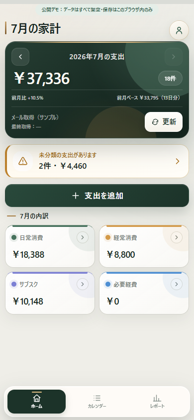
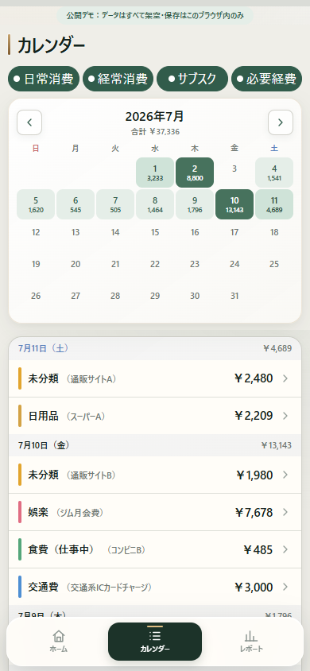
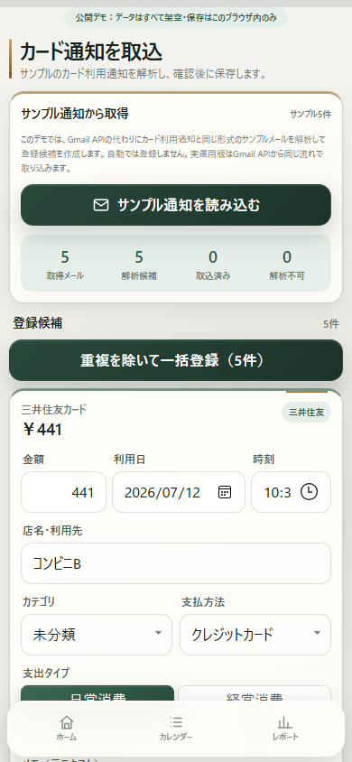
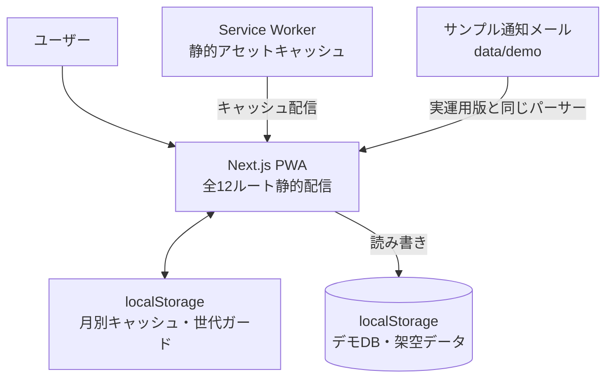
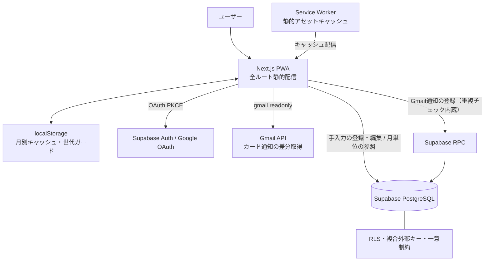

# Mellow 家計簿（公開デモ）


Gmailのカード利用通知を取得し、確認後に支出として登録できる個人用家計簿PWA「Mellow 家計簿」の**公開デモ版**です。

実運用版（Privateリポジトリ・毎日運用中）を基にした凍結スナップショットで、誰でも安全に触れるように次の3点だけを置き換えています。**画面・解析・重複判定・日付演算・キャッシュのコードは実運用版と同じです。**

- データ保存：Supabase PostgreSQL → **ブラウザのlocalStorage**（外部サービスへの通信なし）
- メール取得：Gmail API → **同じ文面形式の架空サンプル通知**（本番と同じパーサーに通します）
- 認証：Googleログイン → なし（開いた瞬間に架空データ3か月分が自動生成されます）

> **公開デモ**：（デモサイトURL、公開後に記載）
> 表示されるデータはすべて架空です。変更はブラウザ内にのみ保存され、アカウント画面からいつでも初期状態に戻せます。

<!-- デモ画面のスクリーンショット（撮影後に差し替え）
| ホーム | カレンダー | サンプル取込 |
|---|---|---|
|  |  |  |
-->

## デモで体験できること

- サンプルのカード利用通知を解析→内容確認→登録する取込フロー（自動登録しない設計）
- 同じ通知を二度読み込んでも候補に出ない重複除外
- 支出の追加・編集・カレンダーの左スワイプ削除とUndo
- ホームの月次集計・カレンダー・レポート（カテゴリ別／支払方法別／支出タイプ別）
- 締め時刻（「1日は朝6時まで」のような区切り）による集計の変化
- カテゴリ・支払方法の追加／改名／色変更／並替／非表示／削除

## 実運用版との違い

| 機能 | 実運用版（Private） | 公開デモ |
|---|:---:|:---:|
| 支出の登録・編集・スワイプ削除・Undo | ○ | ○ |
| 月次集計・カレンダー・レポート | ○ | ○ |
| 締め時刻・カテゴリ等の管理機能 | ○ | ○ |
| カード通知の解析・確認登録・重複除外 | ○ | ○（同一コード） |
| メールの取得元 | Gmail API（差分取得・チェックポイント管理） | サンプル通知に置換 |
| Googleログイン・複数端末同期 | ○ | なし |
| データ保存 | Supabase PostgreSQL（RLS・複合外部キー） | ブラウザ内localStorage |

### 重複防止の保証レベル（正直な差分）

| | 保証内容 |
|---|---|
| 実運用版 | クライアント事前フィルタ → 登録直前照合 → DB関数内チェック → **DBの一意制約**。2端末が同時に取り込んでも二重登録は物理的に成立しない |
| 公開デモ | クライアント事前フィルタと登録時照合（DBがないため制約層はなし） |

デモで体験できるのは「重複を除外する操作フロー」までで、同時実行の最終防衛は実運用版のDB一意制約が担っています。

## アーキテクチャ

### 公開デモ（このリポジトリ）



### 実運用版（Private）



デモ版はデータ層（`lib/data.ts`）だけを差し替えており、Supabaseアクセスがこの1ファイルに集約されていたため、**画面側のコードを1行も変えずに**localStorage実装へ置き換えられています。`@supabase/supabase-js`は依存関係ごと削除してあり、外部へ到達する経路が構造的に存在しません。

## 技術スタック

| 領域 | 採用技術 |
|---|---|
| フロントエンド | Next.js 16（App Router・**全12ルート静的プリレンダリング**）/ React 19 / TypeScript（strict）/ Tailwind CSS v4 |
| データ | localStorage（デモDB＋2層キャッシュ）※実運用版はSupabase PostgreSQL + RLS / Auth / RPC |
| テスト・CI | Vitest（84 tests）/ GitHub Actions（mainへのpush・PR毎に型チェック＋テスト＋本番ビルド＋バンドルサイズ監視） |

## 技術ハイライト

### 1. 通信の追い越しを防ぐ「世代ガード」付きキャッシュ（[lib/kakeiboCache.ts](lib/kakeiboCache.ts)）

データ取得中に削除・登録・設定変更が起きると、遅れて届いた古いレスポンスがキャッシュを汚染しうる——このレースコンディションを、キャッシュに世代番号を持たせて設計で潰しています。**取得開始時の世代を控え、書き込み時に一致しなければ捨てる。** 追い越しシナリオはユニットテストで直接検証しています（[lib/kakeiboCache.test.ts](lib/kakeiboCache.test.ts)）。実運用版と同一のコードです。

### 2. JST・締め時刻の日付演算をテストで担保（[lib/format.ts](lib/format.ts)）

タイムスタンプはUTCで保持されるため、素朴な文字列切り出しでは日本時間の月境界（1日の0〜9時）がひと月ずれます。月・日境界の判定を1モジュールに集約し、UTC/JST境界・閏年・締め時刻の5:59/6:00境界・datetime-localの端末タイムゾーン非依存性をユニットテストで固定しています。

### 3. 自動登録しない取込フロー（[lib/import/](lib/import/)）

カード通知は解析後まず登録候補として表示し、金額・日時・利用先を人が確認してから登録します。解析（[parsers/smbcCard.ts](lib/import/parsers/smbcCard.ts)）と登録を分離しているため、解析ミスがそのままデータへ入ることはありません。サンプルメール（[data/demo/sampleMails.ts](data/demo/sampleMails.ts)）は取込画面とテストが同じものを参照し、デモとテストの乖離を防いでいます。

### 4. 差し替え可能なデータ層（[lib/data.ts](lib/data.ts)）

全データアクセスを1モジュールに集約する設計により、Supabase実装（実運用版）とlocalStorage実装（このデモ）を、関数シグネチャ・エラーメッセージ・キャッシュ連携を保ったまま交換できています。本番のDB制約が担う挙動（重複名の拒否・使用中マスタの削除拒否・再取込との復元衝突）もデモ側で同じエラーメッセージとして再現しています。

## テスト・CI

Vitestによる84件のユニットテストで、キャッシュの世代ガード・TTL、通知メールの解析（プレーンテキスト/ラベル形式・全角正規化・複数利用ブロック）、重複判定、UTC/JST変換・閏年・締め時刻の境界、サンプルメールとパーサーの整合を固定しています。

GitHub Actionsがmainへのpush・PRごとに「型チェック → テスト → 本番ビルド → バンドルサイズ計測（警告300KB／失敗350KB gzip、導入時点250KB）」を実行します。

## AIとの協働について

本プロジェクトは Claude Code との共同開発です（コミットの `Co-Authored-By` 表記参照）。役割分担：

- **作者**：要件定義・仕様の意思決定・優先順位判断・実機検証・障害の発見と報告・採用可否の最終判断
- **AI（Claude Code）**：作者の指示と判断のもとで実装・テスト作成・リファクタリングを担当。全変更は作者の検証を通してから採用

複数のAIエージェントによる独立レビューと反証検証（発見→反証の2段構え）を定期的に実施しています。設計判断の説明責任は作者が持ちます。

## セットアップ

```bash
npm install
npm run dev
```

環境変数は不要です（外部サービスを使用しないため）。

- テスト: `npm test` ／ 型チェック: `npm run lint` ／ 本番ビルド: `npm run build`

## 実運用版について

実運用版はGoogleログイン（OAuth PKCE）・Gmail API（readonly・差分取得）・Supabase（全テーブルRLS・複合外部キー・一意制約バックストップ付きRPC）を用い、作者がスマホPWAとPCの2端末で毎日運用しています。個人の家計データを含むため、リポジトリとURLは非公開です。選考等でご興味があれば、画面共有等で個別にご紹介します。

## ライセンス

ポートフォリオとしての閲覧・参考を目的に公開しています。ライセンスは付与していないため、コードの再利用・再配布はご遠慮ください。
