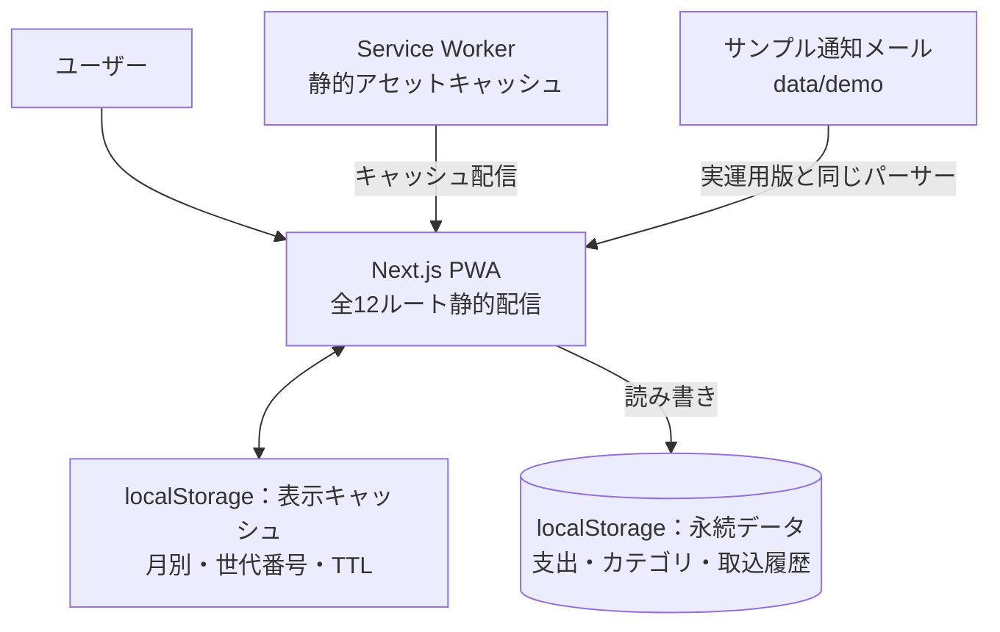
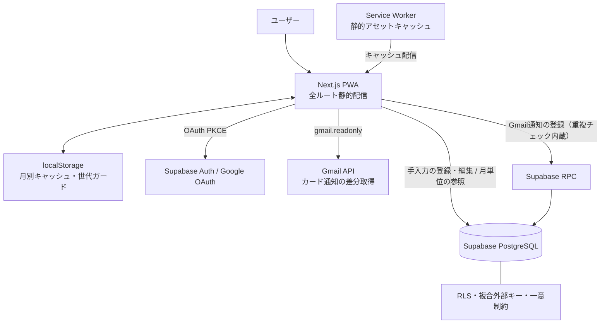

# Mellow 家計簿 — 公開デモ


Gmailのカード利用通知を解析し、内容を確認してから支出登録できる、個人用の家計簿PWAです。
実運用版（Private・毎日運用中）を基に、認証・外部API・データベースだけを安全なローカル実装へ置き換えた公開デモです。

> **デモサイト**：https://main.d2tz2x2do75dmc.amplifyapp.com/
> ログイン不要・データはすべて架空・保存先はブラウザのlocalStorageのみ。アカウント画面からいつでも初期状態に戻せます。

| ホーム | カレンダー | サンプル取込 |
|---|---|---|
|  |  |  |

## 60秒で試す

1. ホームで架空データ3か月分の月次集計を見る（前月比・内訳・未分類の通知）
2. ホームの「更新」でサンプルのカード利用通知5件を読み込む
3. 候補の金額・利用日・利用先を確認し、「重複を除いて一括登録」
4. もう一度読み込むと、登録済みの通知は候補から除外される（重複防止）
5. カレンダーで明細を左スワイプ→削除→「元に戻す」でUndo

## デモで体験できること

- サンプル通知の解析 → 内容確認 → 登録という取込フロー（自動登録しない設計）
- 同じ通知を二度読み込んでも候補に出ない重複除外
- 支出の追加・編集、カレンダーのスワイプ削除とUndo
- 月次レポート（カテゴリ別／支払方法別／支出タイプ別）
- 締め時刻（「1日は朝6時まで」のような区切り）による集計の変化
- カテゴリ・支払方法の追加／改名／色変更／並替／非表示／削除

## 実運用版との違い

| 機能 | 実運用版（Private） | 公開デモ |
|---|:---:|:---:|
| 支出の登録・編集・スワイプ削除・Undo | ○ | ○ |
| 月次集計・カレンダー・レポート | ○ | ○ |
| 締め時刻・カテゴリ等の管理機能 | ○ | ○ |
| カード通知の解析・確認登録・重複除外 | ○ | ○（同一コード） |
| メールの取得元 | Gmail API（差分取得・チェックポイント管理） | サンプル通知に置換 |
| Googleログイン・複数端末同期 | ○ | なし |
| データ保存 | Supabase PostgreSQL（RLS・複合外部キー） | ブラウザ内localStorage |

### 重複防止の保証レベル

| | 保証内容 |
|---|---|
| 実運用版 | クライアント事前フィルタ → 登録直前照合 → DB関数内チェック → **DBの一意制約**。2端末が同時に取り込んでも二重登録は物理的に成立しない |
| 公開デモ | クライアント事前フィルタと登録時照合（DBがないため制約層はなし） |

デモで体験できるのは「重複を除外する操作フロー」までで、同時実行の最終防衛は実運用版のDB一意制約が担っています。

## 技術ハイライト

### 1. 通信の追い越しを防ぐ「世代ガード」付きキャッシュ（[lib/kakeiboCache.ts](lib/kakeiboCache.ts)）

データ取得中に削除・登録・設定変更が起きると、遅れて届いた古いレスポンスがキャッシュを汚染しうる——このレースコンディションを、キャッシュに世代番号を持たせて設計で潰しています。**取得開始時の世代を控え、書き込み時に一致しなければ捨てる。** 追い越しシナリオはユニットテストで直接検証しています（[lib/kakeiboCache.test.ts](lib/kakeiboCache.test.ts)）。実運用版と同一のコードです。

### 2. JST・締め時刻の日付演算をテストで担保（[lib/format.ts](lib/format.ts)）

タイムスタンプはUTCで保持されるため、素朴な文字列切り出しでは日本時間の月境界（1日の0〜9時）がひと月ずれます。月・日境界の判定を1モジュールに集約し、UTC/JST境界・閏年・締め時刻の5:59/6:00境界・datetime-localの端末タイムゾーン非依存性をユニットテストで固定しています。

### 3. 自動登録しない取込フロー（[lib/import/](lib/import/)）

カード通知は解析後まず登録候補として表示し、金額・日時・利用先を人が確認してから登録します。解析（[parsers/smbcCard.ts](lib/import/parsers/smbcCard.ts)）と登録を分離しているため、解析ミスがそのままデータへ入ることはありません。サンプルメール（[data/demo/sampleMails.ts](data/demo/sampleMails.ts)）は取込画面とテストが同じものを参照し、デモとテストの乖離を防いでいます。

### 4. 差し替え可能なデータ層（[lib/data.ts](lib/data.ts)）

全データアクセスを1モジュールに集約する設計により、Supabase実装（実運用版）とlocalStorage実装（このデモ）を、関数シグネチャ・エラーメッセージ・キャッシュ連携を保ったまま交換しています。**データ層を経由する画面（ホーム・カレンダー・レポート・登録/編集・設定）はコード変更なしでそのまま動作**し、認証まわりの画面と取込のメール取得部分だけをデモ用に置き換えました。本番のDB制約が担う挙動（重複名の拒否・使用中マスタの削除拒否・再取込との復元衝突）も、デモ側で同じエラーメッセージとして再現しています。

## アーキテクチャ

### 公開デモ（このリポジトリ）



デモDB（永続データ）と表示キャッシュは同じlocalStorage上にありますが、用途とキー空間を分離しています。認証・外部API・外部データベースへの通信経路は、このデモから依存関係ごと削除しています（`@supabase/supabase-js`も依存に含まれません）。

### 実運用版（Private）

<details>
<summary>実運用版の構成図を見る（Supabase・RPC・RLS）</summary>



</details>

## テスト・CI

Vitestによる84件のユニットテストで、キャッシュの世代ガード・TTL、通知メールの解析（プレーンテキスト/ラベル形式・全角正規化・複数利用ブロック）、重複判定、UTC/JST変換・閏年・締め時刻の境界、サンプルメールとパーサーの整合を固定しています。

GitHub Actionsがmainへのpush・PRごとに「型チェック → テスト → 本番ビルド → バンドルサイズ計測（警告300KB／失敗350KB gzip、導入時点250KB）」を実行します。

## 技術スタック

| 領域 | 採用技術 |
|---|---|
| フロントエンド | Next.js 16（App Router・全12ルート静的プリレンダリング）/ React 19 / TypeScript（strict）/ Tailwind CSS v4 |
| データ | localStorage（デモDB＋2層キャッシュ）※実運用版はSupabase PostgreSQL + RLS / Auth / RPC |
| テスト・CI | Vitest / GitHub Actions |

## セットアップ

```bash
npm install
npm run dev
```

環境変数は不要です（外部サービスを使用しないため）。

- テスト: `npm test` ／ 型チェック: `npm run lint` ／ 本番ビルド: `npm run build`

## AIとの協働

本プロジェクトは Claude Code との共同開発です（コミットの `Co-Authored-By` 表記参照）。
要件定義・仕様決定・優先順位判断・実機検証・採用可否の判断は作者が行い、AIは作者の指示のもとで実装とテスト作成を担当しています。AIによる変更も、テストと実機確認を通してから採用しています。

## 実運用版について

実運用版はGoogleログイン（OAuth PKCE）・Gmail API（readonly・差分取得）・Supabase（全テーブルRLS・複合外部キー・一意制約バックストップ付きRPC）を用い、作者がスマホPWAとPCの2端末で毎日運用しています。個人の家計データを含むため、リポジトリとURLは非公開です。

## License

本リポジトリはポートフォリオ閲覧を目的として公開しています。明示的なライセンスは付与していません（コードの利用・改変・再配布は許諾していません）。
