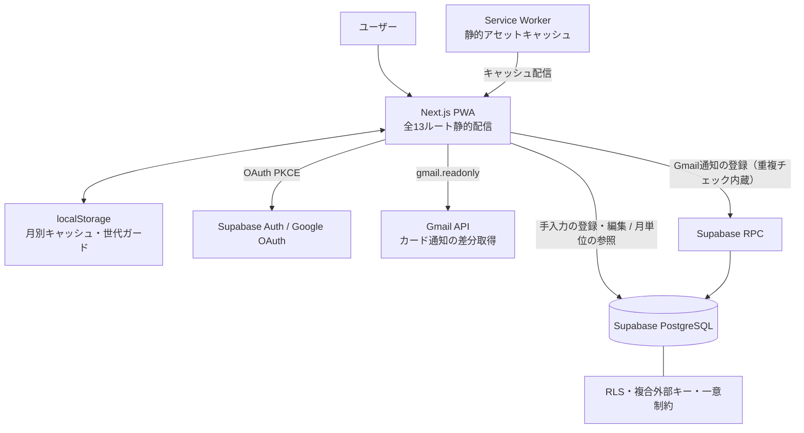

# Mellow 家計簿


## 概要

Gmailのカード利用通知を取得し、確認後に支出として登録できる個人用家計簿PWAです。
Next.js / TypeScript / Supabase / Gmail API を用い、認証・RLS・重複防止・CIまで含めて実装しました。
実運用を前提に、スマホPWAでの入力負担削減と月次レポートの見やすさを重視しています。

三井住友カードの利用通知をGmailから取得し、内容を確認して1タップで記録。現金支出の手入力と合わせて、カレンダー・月次レポートで家計を可視化します。スマホ（PWA）とPCの2端末で毎日運用しています。

> 個人データとGmail連携を扱うため、デモURLは応募先に応じて個別共有します。デモ環境ではGmail取得機能を制限する想定です。

| ホーム | カレンダー | Gmail取込 |
|---|---|---|
|  |  |  |

## 解決したかった課題

- カード利用通知を家計簿へ手入力する負担を減らす
- 複数端末から取り込んでも、同じ通知を二重登録させない
- 深夜の支出を、生活リズムに合った日付で集計する（締め時刻）
- スマホ回線でも待たされずに、開いた瞬間に家計を確認できるようにする
- 自動化しすぎない——登録内容は必ず人が確認してから保存する

## 主な機能

- **Gmail自動取込** — カード利用通知を解析して登録候補を生成。自動登録はせず、必ず人が確認してから保存
- **重複の4層防御** — クライアント事前フィルタ → 登録直前照合 → DB関数内チェック → 一意制約。2端末が同時に取り込んでも二重登録は物理的に成立しない
- **カレンダー** — 月グリッド＋日付見出し付きの明細リスト。日付タップでスクロール、左スワイプで出る削除ボタンから削除（Undo付き）
- **締め時刻** — 「1日は朝6時まで」のような区切りを設定でき、深夜の支出を前日として集計（端末間で同期）
- **管理機能** — カテゴリ・支払方法の追加/改名/色変更/並替/非表示/削除、内訳（支出タイプ）の改名/非表示
- **体感速度** — localStorage永続キャッシュ（stale-while-revalidate）で、2回目以降の起動は前回データを即表示→裏で更新。JS/CSSはService Workerがキャッシュ配信し、再ダウンロードなし

## 技術スタック

| 領域 | 採用技術 |
|---|---|
| フロントエンド | Next.js 16（App Router・**全13ルート静的プリレンダリング**）/ React 19 / TypeScript（strict）/ Tailwind CSS v4 |
| バックエンド | Supabase（PostgreSQL + RLS / Auth / RPC）、Gmail API（readonly） |
| テスト・CI | Vitest（100+ tests）/ GitHub Actions（mainへのpush・PR毎に型チェック＋テスト＋本番ビルド＋バンドルサイズ監視） |
| ホスティング | AWS Amplify Hosting |

## アーキテクチャ



支出の手入力・編集は通常のクエリとして実行し（RLSとDB制約が防御）、重複判定を伴うGmail通知の登録だけがRPCを経由します。

## 技術ハイライト

### 1. 通信の追い越しを防ぐ「世代ガード」付きキャッシュ（[lib/kakeiboCache.ts](lib/kakeiboCache.ts)）

データ取得中に削除・登録・設定変更・ログアウトが起きると、遅れて届いた古いレスポンスがキャッシュを汚染しうる——このレースコンディションを、キャッシュに世代番号を持たせて設計で潰しています。**取得開始時の世代を控え、書き込み時に一致しなければ捨てる。** 追い越しシナリオはユニットテストで直接検証しています（[lib/kakeiboCache.test.ts](lib/kakeiboCache.test.ts)）。

あわせて、localStorage復元時のユーザー照合（共有端末で他人の家計を一瞬でも表示しない）、ログアウト時の全消去、14日TTL、スキーマバージョン管理を実装しています。

### 2. DBレベルの多層防御（[supabase/schema.sql](supabase/schema.sql)）

- 全5テーブルにRLS（行レベルセキュリティ）を操作別に設定
- **複合外部キー** `(category_id, user_id)` により、「他人のカテゴリを自分の支出に紐づける」攻撃をRLSとは独立にDB制約でも遮断
- メール取込のRPCは invoker権限＋一意制約バックストップで、同時実行の競合が23505エラーに収束する設計
- Googleのrefresh token（provider_refresh_token）を意図的にクライアントへ保持しない判断とその理由をコードコメントに明文化（[lib/auth.ts](lib/auth.ts)）

### 3. JST・締め時刻の日付演算をテストで担保（[lib/format.ts](lib/format.ts)）

SupabaseはUTCでタイムスタンプを返すため、素朴な文字列切り出しでは日本時間の月境界（1日の0〜9時）がひと月ずれます。月・日境界の判定を1モジュールに集約し、UTC/JST境界・閏年・締め時刻の5:59/6:00境界・datetime-localの端末タイムゾーン非依存性をユニットテストで固定しています。

### 4. 自動登録しないGmail取込フロー（[lib/gmail.ts](lib/gmail.ts) / [lib/import/useGmailImport.ts](lib/import/useGmailImport.ts)）

取得したカード通知は直接保存せず、専用パーサー（[lib/import/parsers/smbcCard.ts](lib/import/parsers/smbcCard.ts)）の解析結果を登録候補として表示し、金額・日時・利用先を人が確認してから登録します。解析と登録を分離しているため、解析ミスがそのままDBへ入ることはありません。

差分取得は前回取得時刻を基準にしつつ、**全件を取りきれなかった場合はチェックポイントを進めない**設計で、未読メールを「処理済み」と誤認しません。検索には24時間の重なりを持たせてGmail検索インデックスの反映遅延による取りこぼしを防ぎ、重なりで再取得された分は取込済みフィルタが静かに除外します。

## セキュリティ設計

### 実装済みの対策

- 全5テーブルに操作別のRLS＋複合外部キーによるDB制約の二重化（技術ハイライト2参照）
- Gmail権限は読み取り専用（`gmail.readonly`）に限定
- Googleのrefresh tokenをクライアントへ保持せず、XSS時でもGmailへの長期アクセス権は漏れない構成
- キャッシュ復元時のユーザーID照合と、ログアウト時のキャッシュ全消去
- `.env*`はGit管理外（公開する`.env.example`はダミー値のみ）

### 既知のトレードオフ

個人利用の純クライアント構成として、以下を**把握した上で**運用しています：

- Gmailのアクセストークン（readonly・短命）とSupabaseセッション（refresh token含む）はlocalStorageに保持されます。Googleのrefresh tokenを保持しないことでGmail側の被害を限定していますが、構造的な解決（トークンのサーバー側保管）は一般公開時の必須工事として計画済み
- エラー監視（Sentry等）・CSPヘッダは未導入。導入位置（エラー変換の集約点）は確保済み

## テスト・CI

Vitestによる100件超のユニットテストで、壊れても気づきにくい境界を固定しています。主な対象：

- キャッシュの世代ガード（通信の追い越し）・TTL・ユーザー照合
- Gmail本文の解析（プレーンテキスト/HTML・文字参照・表組みレイアウト）と重複判定
- UTC/JST変換・月初月末・閏年・締め時刻の直前直後

GitHub Actionsがmainへのpush・PRごとに「型チェック → テスト → 本番ビルド → バンドルサイズ計測」を実行します。サイズ計測はJS/CSSのgzip合計を警告380KB・失敗450KBの閾値で監視し（導入時点322KB）、依存追加による静かな肥大化を検知します。

## AIとの協働について

本プロジェクトは Claude Code との共同開発です（コミットの `Co-Authored-By` 表記参照）。役割分担：

- **作者**：要件定義・仕様の意思決定・優先順位判断・実機検証・障害の発見と報告・SQL本番適用・採用可否の最終判断
- **AI（Claude Code）**：作者の指示と判断のもとで実装・テスト作成・リファクタリングを担当。全変更は作者の検証を通してから採用

複数のAIエージェントによる独立レビューと反証検証（発見→反証の2段構え）を定期的に実施し、そこで指摘された退行（CSSの共有セレクタを巻き添えにした削除など）を修正した履歴もコミットに残しています。設計判断の説明責任は作者が持ちます。

## 開発経緯

- **2026/07/01頃** ローカルで試作開始（初回コミットに先行する日付のマイグレーションSQLはこの期間の成果物）
- **07/09** GitHub導入・CI整備・AWS Amplifyで公開。認証（匿名→Google連携）の2端末問題を解決
- **07/09〜** レビュー駆動で改善を反復：月単位フェッチ化・永続キャッシュ・全ルート静的化・管理機能・締め時刻などを追加

## 今後の改善予定

- Gmailアクセストークンのサーバー側管理（Route Handler / Edge Functions）とCSPヘッダの導入 — 一般公開時の必須工事
- エラー監視（Sentry等）の導入
- 本番と分離したデモ用Supabase環境と、実際のGmailを接続せずに試せるサンプルメール取込モード

## セットアップ

```bash
npm install
cp .env.example .env.local  # Supabaseの値を設定
npm run dev
```

- DB構築: [SUPABASE_SETUP.md](SUPABASE_SETUP.md)（スキーマ・マイグレーション適用手順）
- Google認証・Gmail連携: [supabase/GOOGLE_AUTH_SETUP.md](supabase/GOOGLE_AUTH_SETUP.md)
- テスト: `npm test` ／ 型チェック: `npm run lint`
